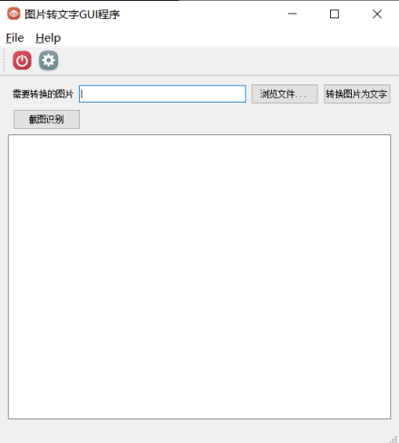

# TextRec
一个基于PyQt5和百度图像识别API的文本检测程序，其中基于pyqt5的截图功能来自项目[https://github.com/ianzhao05/textshot](https://github.com/ianzhao05/textshot)
## Pre-requests
1. pytesseract和Tesseract：`textrec-tesseract.py`沿用了textshot中使用tesseract进行识别的方法，需要在[https://github.com/tesseract-ocr/tesseract](https://github.com/tesseract-ocr/tesseract)下载安装，如果是Windows系统，可以在[https://github.com/UB-Mannheim/tesseract/wiki](https://github.com/UB-Mannheim/tesseract/wiki)下载安装预编译版本，并且添加到系统环境路径；pytesseract是python调用接口；如果不需要这个，也可以删除相关代码；
2. baidu-aip: 百度提供的图像识别API；
3. Pillow
4. PyQt5

## 使用方法
### 1. 使用tesseract
安装tesseract后可以下载很多语言模型，本程序默认使用简体中文(`chi_sim`)，也可以选择`chi_tra`，`eng`等，代码修改位置在**第277行**.
```bash
$ python textrec-tesseract.py
```


### 2. 使用百度云接口
自己去百度云申请图像文本检测的开发接口，得到id，秘钥等信息，修改代码，填入自己申请的信息：
```python
        # 手动输入百度图像处理API接口，同时取消注释
        self.APP_ID = None 
        self.API_KEY = None
        self.SECRET_KEY = None
        self.aipOcr = AipOcr(self.APP_ID, self.API_KEY, self.SECRET_KEY)
```
如果不在程序中硬编码，则需要在运行程序后进入**设置**界面设置
```bash
$ python textrec-aip.py
```
